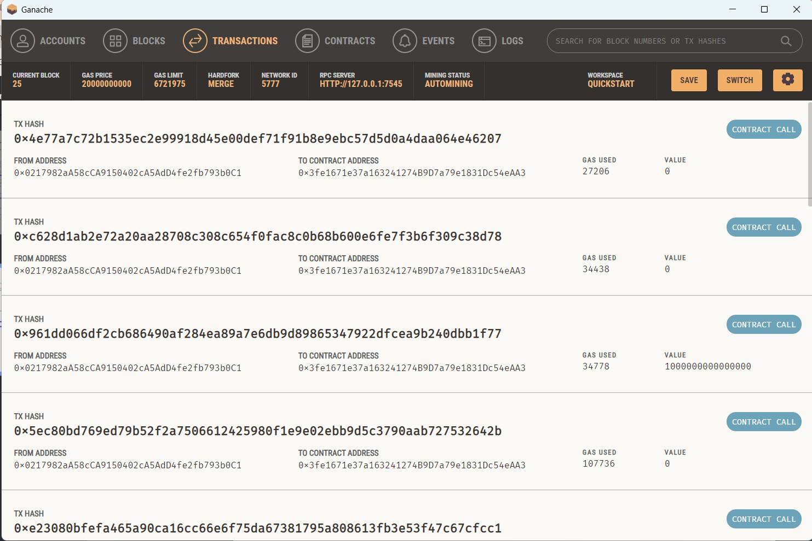
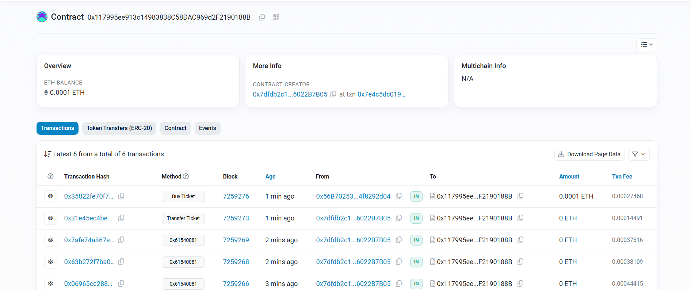

# Išmanioji sutartis

## Verslo modelis

Pasirinkau decentralizuotos bilietų prekybvietės verslo modelį. Bet kuris tinklo vartotojas gali kurti renginius ir į pardavimą paleisti to renginio bilietus. Kiti tinklo nariai tuos bilietus gali nusipirkti už renginio organizatoriaus nustatytą kainą. Organizatorius gali į prekybą paleisti tiek bilietų, kiek nori. Taip pat, ši išmanioji sutartis leidžia perduoti bilietą kitam vartotojui. Bilietus perduoti kitam vartotojui gali tik jų savininkai. Saugant nuo sukčiavimo, ši sutartis neleidžia sukurti dviejų identiškų renginių. Taip pat, apie kiekvieno renginio informaciją galima sužinoti, žinant jo ID. Bei žinant bilieto ir renginio ID, galima sužinoti bilieto savininko adresą.

## Testavimas lokaliame Ethereum tinkle

Testavimui lokialiame tinkle naudojau Ganache, tam kad galėčiau nesunkiai matyti visas transakcijas, vykstančias išmaniojoje sutartyje.

Žemiau galite matyti transakcijų istoriją lokaliame tinkle:

## Testavimas Ethereum testiniame tinkle Sepolia

Išmaniosios sutarties testavimui Ethereum testiniame tinkle naudojau Sepolia testinį tinklą, o tam, kad šiame testiniame tinkle galėčiau dislokuoti savo išmaniąją sutartį, naudojau įrankį Alchemy. Apačioje pateiktame paveikslėlyje galite matyti Sepolia tinkle atliktas transakcijas mano išmaniojoje sutartyje:
